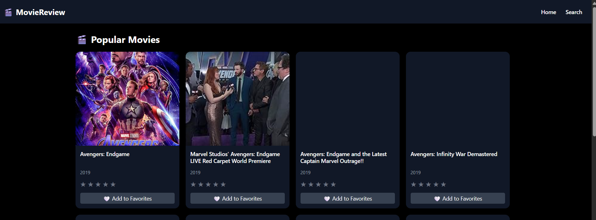
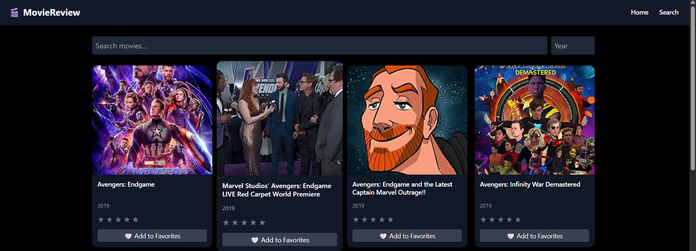
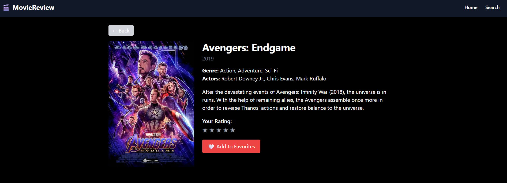
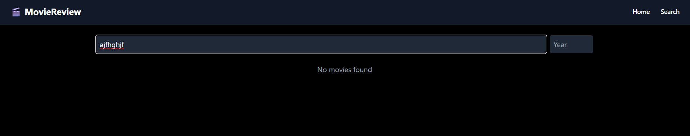
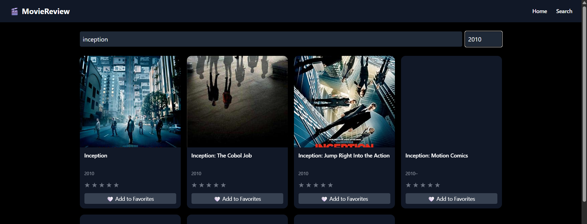

# 🎬 Movie Review App

A modern and responsive Movie Review web application built using React, Redux Toolkit, TypeScript, and Tailwind CSS.  
Users can search for movies, filter results, view detailed information, rate movies, and manage their favorites.

---


--netlify 

https://moviereview-assignment.netlify.app/

---

## 🚀 Features

- 🔍 Search movies using OMDb API
- 📅 Filter movies by year
- 🎬 View detailed movie information (poster, plot, cast, etc.)
- ⭐ Rate movies (1–5 star system)
- ❤️ Add or remove movies from favorites
- 🌙 Dark mode UI
- 📱 Fully responsive design
- ⚡ Fast and optimized performance

---

## 🛠 Tech Stack

- **Frontend:** React JS  
- **State Management:** Redux Toolkit  
- **Language:** TypeScript  
- **Styling:** Tailwind CSS  
- **API:** OMDb API  

---

## 📸 Screenshots

### 🏠 Home Page


### 🔍 Search Page


### 🎬 Movie Details


### 🎬 no Movie Found 


### 🎬  Movie Found 


## 📦 Installation & Setup

Clone the repository:

```bash

cd MovieReview
npm install
npm run dev


## 🔑 Environment Variables

Create a `.env` file:

VITE_OMDB_API_KEY=your_api_key


## 👩‍💻 Author

Apoorva Bairi